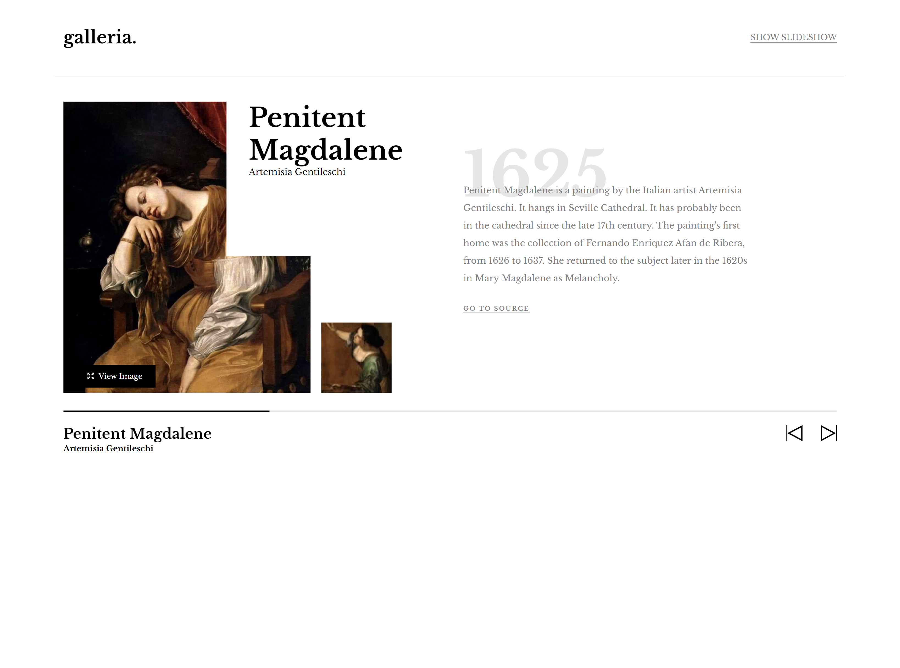

# Galleria Slideshow

## Welcome! 👋

- [GitHub Pages](https://github.com/sukanyagurav/Buy-Desserts)
- [Netlify](https://buydesserts5867.netlify.app/)

### Galleria Desktop View     

 

    <h2> Tech stack used</h2>

  

## Overview

Users should be able to: 

- View the optimal layout for the app depending on their device's screen size
- See hover states for all interactive elements on the page
- Navigate the slideshow and view each painting in a lightbox

### Galleria detailed View       

 

**Have fun building!** 🚀
